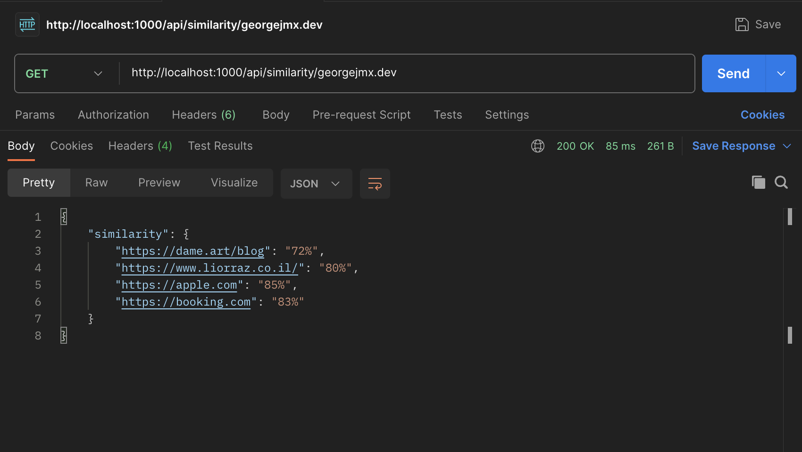

# User Guide

1. Insert websites into Site Mapper, _supports a maximum of 5 at once_

`POST /api/sketch` with body

```
{
    "urls": [
        "https://georgejmx.dev",
        "https://apple.com",
        "https://booking.com",
        "https://dame.art/blog",
        "https://www.liorraz.co.il"
    ]
}
```

2. Retrieve an ordered list of similarity using the `/api/similarity/url` endpoint


